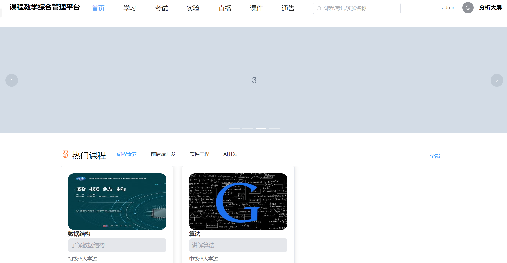
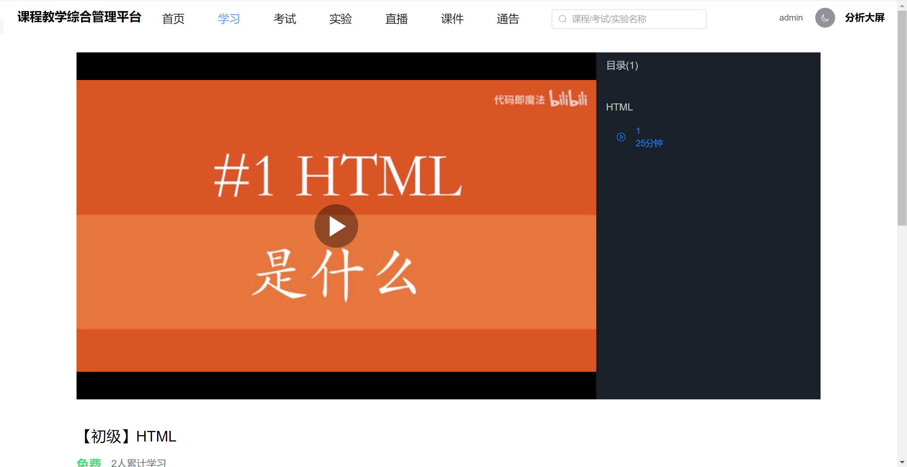
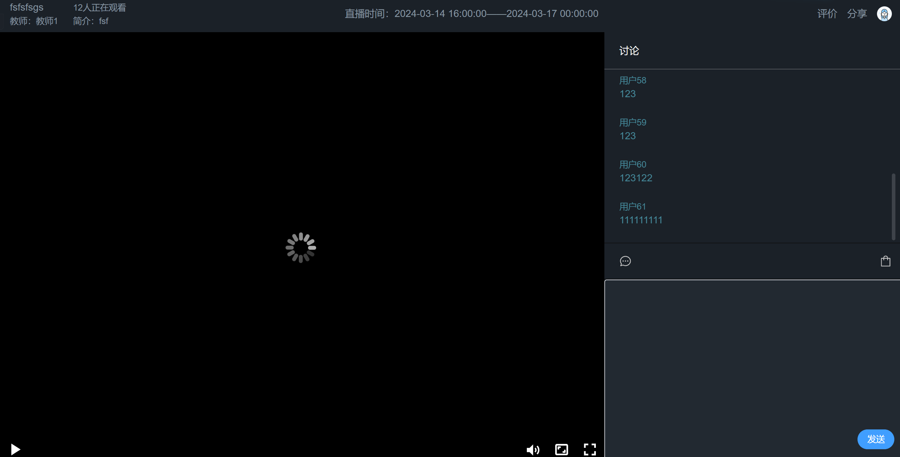
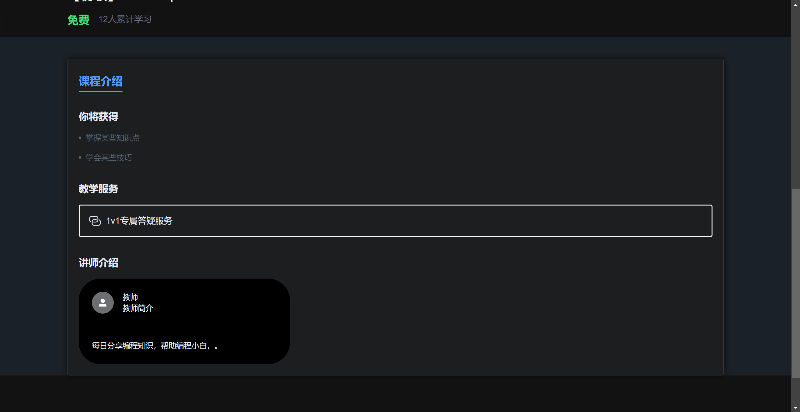
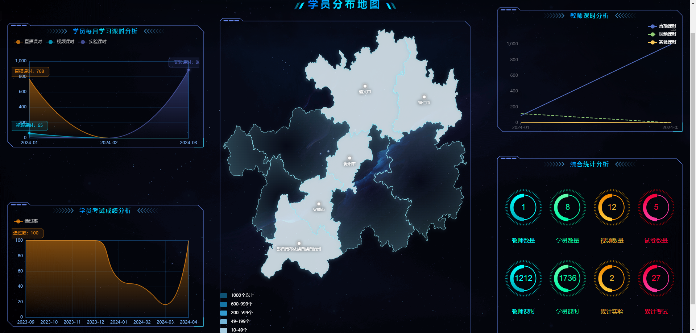

---

---

## 简介
本`课程教学综合管理平台`是正在开发的课程平台的一期。本仓库为前端实现，使用了最新的 `Vue3`、`Vite`、`Element-Plus`、`TypeScript`、`Pinia`、`Tailwindcss` 等主流技术开发, 其中播放器组件使用的是[xgplayer](https://h5player.bytedance.com/api/)


## 项目功能

1. **首页**

   

2. **课程学习**



 3. **直播学习**

    

 4. **黑夜模式**

    

5. **数据大屏**

   

### 正在学习(不在本项目中)

使用`threejs`实现虚拟仿真实验


## 安装使用

- 安装依赖

```bash
pnpm install
```

- 运行

```bash
pnpm dev
```

- 打包

```bash
pnpm build
```